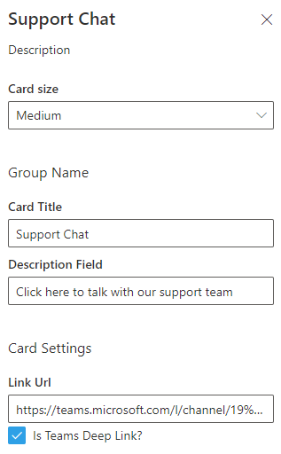

# Basic Card with Teams Deep Linking

## Summary

This example shows a basic ACE with a single card view. The settings allow you to set the link launched by the card. You can set the URL to anything you like and the card will launch it. For Teams links, paste in the link from "Get link to channel" and select the "Is Teams Deep Link".

Highlights:

- Basic properties and updating the property pane
- How link actions work and properties are accessed within a solution
- Updating the code to use async/await

### Screen Shots

_Card View_

_Settings showing link Url_

## Used SharePoint Framework Version

## Applies to

- [SharePoint Framework](https://aka.ms/spfx)
- [Microsoft 365 tenant](https://docs.microsoft.com/en-us/sharepoint/dev/spfx/set-up-your-developer-tenant)

> Get your own free development tenant by subscribing to [Microsoft 365 developer program](http://aka.ms/o365devprogram)

## Prerequisites

None

## Solution

Solution|Author(s)
--------|---------
teams-chat-card | Microsoft

## Version history

Version|Date|Comments
-------|----|--------
1.0|August 22, 2021|Initial release

## Disclaimer

**THIS CODE IS PROVIDED *AS IS* WITHOUT WARRANTY OF ANY KIND, EITHER EXPRESS OR IMPLIED, INCLUDING ANY IMPLIED WARRANTIES OF FITNESS FOR A PARTICULAR PURPOSE, MERCHANTABILITY, OR NON-INFRINGEMENT.**

---

## Minimal Path to Awesome

- Clone this repository
- Ensure that you are at the solution folder
- in the command-line run:
  - **npm install**
  - **gulp serve --nobrowser**

## References

- [Extend Microsoft Viva Connections Learn Path](https://aka.ms/m365/dev/learn/connections)
- [Getting started with SharePoint Framework](https://docs.microsoft.com/en-us/sharepoint/dev/spfx/set-up-your-developer-tenant)
- [Building for Microsoft teams](https://docs.microsoft.com/en-us/sharepoint/dev/spfx/build-for-teams-overview)
- [Use Microsoft Graph in your solution](https://docs.microsoft.com/en-us/sharepoint/dev/spfx/web-parts/get-started/using-microsoft-graph-apis)
- [Publish SharePoint Framework applications to the Marketplace](https://docs.microsoft.com/en-us/sharepoint/dev/spfx/publish-to-marketplace-overview)
- [Microsoft 365 Patterns and Practices](https://aka.ms/m365pnp) - Guidance, tooling, samples and open-source controls for your Microsoft 365 development

