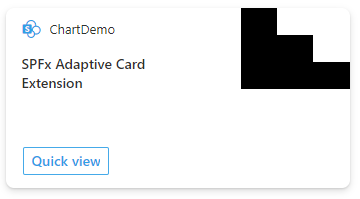
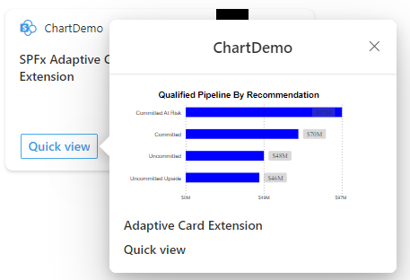

# ace-chart

## Summary

This sample shows how to generate a dynamic SVG which you can bind to data, in this case to show a bar chart with various visual features in the quick view. Included is a static sample showing how a dynamic SVG can be included in an L1 card view.

The card view showing a generated SVG image

The quick view showing the dynamically generated SVG chart image

## Used SharePoint Framework Version

## Applies to

- [SharePoint Framework](https://aka.ms/spfx)
- [Microsoft 365 tenant](https://docs.microsoft.com/en-us/sharepoint/dev/spfx/set-up-your-developer-tenant)

> Get your own free development tenant by subscribing to [Microsoft 365 developer program](http://aka.ms/o365devprogram)

## Prerequisites

None

## Solution

| Solution    | Author(s)                                               |
| ----------- | ------------------------------------------------------- |
| ace-chart | Patrick Rodgers (Microsoft) |

## Version history

| Version | Date             | Comments        |
| ------- | ---------------- | --------------- |
| 1.1     | March 10, 2021   | Update comment  |
| 1.0     | January 29, 2021 | Initial release |

## Disclaimer

**THIS CODE IS PROVIDED _AS IS_ WITHOUT WARRANTY OF ANY KIND, EITHER EXPRESS OR IMPLIED, INCLUDING ANY IMPLIED WARRANTIES OF FITNESS FOR A PARTICULAR PURPOSE, MERCHANTABILITY, OR NON-INFRINGEMENT.**

---

## Minimal Path to Awesome

- Clone this repository
- Ensure that you are at the solution folder
- in the command-line run:
  - **npm install**
  - **gulp serve**

> Include any additional steps as needed.

## Features

Description of the extension that expands upon high-level summary above.

This extension illustrates the following concepts:

- Dynamic SVG templates
- Generated SVG in card view

## References

- [Getting started with SharePoint Framework](https://docs.microsoft.com/en-us/sharepoint/dev/spfx/set-up-your-developer-tenant)
- [Building for Microsoft teams](https://docs.microsoft.com/en-us/sharepoint/dev/spfx/build-for-teams-overview)
- [Use Microsoft Graph in your solution](https://docs.microsoft.com/en-us/sharepoint/dev/spfx/web-parts/get-started/using-microsoft-graph-apis)
- [Publish SharePoint Framework applications to the Marketplace](https://docs.microsoft.com/en-us/sharepoint/dev/spfx/publish-to-marketplace-overview)
- [Microsoft 365 Patterns and Practices](https://aka.ms/m365pnp) - Guidance, tooling, samples and open-source controls for your Microsoft 365 development
