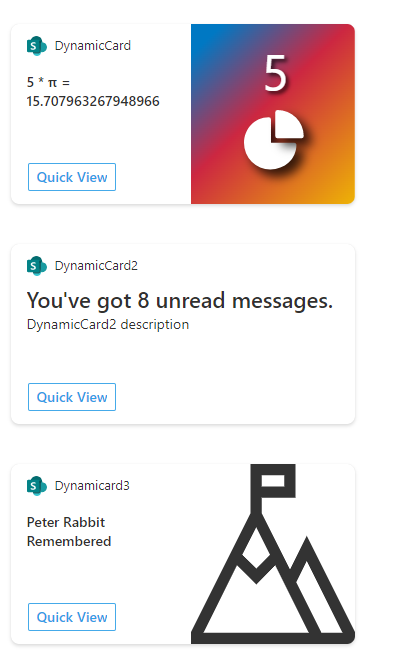

# ace-dynamic-card

## Summary

Includes three ACE's showing simple ways to include dynamic content and liven up the appearance of your ACE's. Through text updates, dymamically created SVG images, or rotating content you can make your cards more interesting and catch user's attention.



## Used SharePoint Framework Version


## Applies to

- [SharePoint Framework](https://aka.ms/spfx)
- [Microsoft 365 tenant](https://docs.microsoft.com/en-us/sharepoint/dev/spfx/set-up-your-developer-tenant)

> Get your own free development tenant by subscribing to [Microsoft 365 developer program](http://aka.ms/o365devprogram)

## Solution

Solution|Author(s)
--------|---------
adaptiveCardExtensions | Patrick Rodgers (Microsoft)

## Version history

Version|Date|Comments
-------|----|--------
1.0|February 7, 2022|Initial release

## Disclaimer

**THIS CODE IS PROVIDED *AS IS* WITHOUT WARRANTY OF ANY KIND, EITHER EXPRESS OR IMPLIED, INCLUDING ANY IMPLIED WARRANTIES OF FITNESS FOR A PARTICULAR PURPOSE, MERCHANTABILITY, OR NON-INFRINGEMENT.**

---

## Minimal Path to Awesome

- Clone this repository
- Ensure that you are at the solution folder
- in the command-line run:
  - **npm install**
  - **gulp serve**

## Features

This sample shows three simple ways to add dynamic content to your ACE cards. Each card updates the state using a self-resetting timer pattern:

```TypeScript
// create a function to update state
const fixture = () => {

  // update state, these changes could come from web calls, user interactions (paging), or static values
  this.setState({
    description: this.properties.description + this.state.timerCounter + 1,
    timerCounter: this.state.timerCounter + 1,
  });

  // call the same function again with a delay
  setTimeout(fixture, 5000);
};

// start the process by calling the function directly, it will run once then start a timer for subsequent runs
fixture();
```


## References

- [Getting started with SharePoint Framework](https://docs.microsoft.com/en-us/sharepoint/dev/spfx/set-up-your-developer-tenant)
- [Building for Microsoft teams](https://docs.microsoft.com/en-us/sharepoint/dev/spfx/build-for-teams-overview)
- [Use Microsoft Graph in your solution](https://docs.microsoft.com/en-us/sharepoint/dev/spfx/web-parts/get-started/using-microsoft-graph-apis)
- [Publish SharePoint Framework applications to the Marketplace](https://docs.microsoft.com/en-us/sharepoint/dev/spfx/publish-to-marketplace-overview)
- [Microsoft 365 Patterns and Practices](https://aka.ms/m365pnp) - Guidance, tooling, samples and open-source controls for your Microsoft 365 development