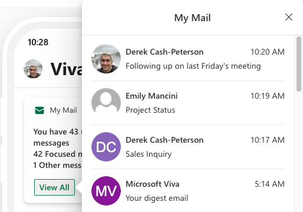
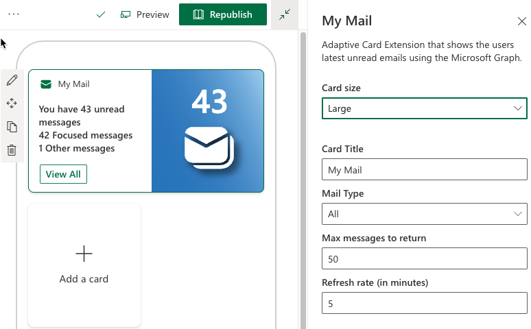
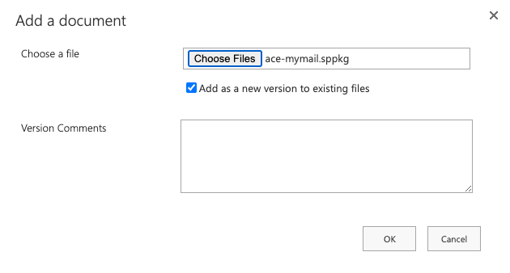
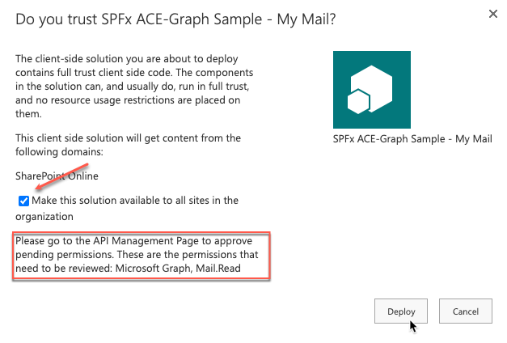
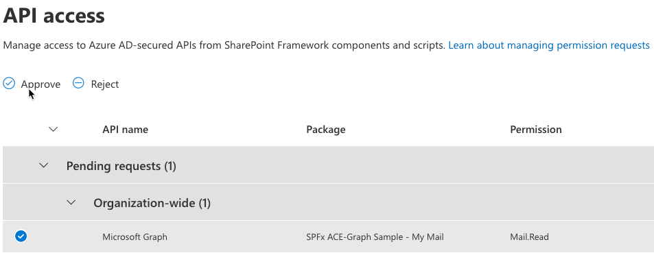
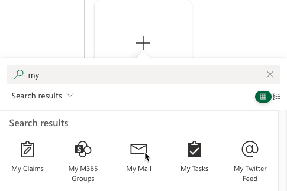

# ace-mymail

## Summary

This Adaptive Card Extension is an example to show how to create a card view the dynamically updates as well as shows how to leverage the Microsoft Graph to surface data. The ACE uses the Graph to get the email of the current user. The Card View displays the current number of emails and updates on a timer that is set in the configuration of the ACE. The Quick View shows the subject, received date/time, and a short preview of the message. The user can click on the email to go the web version of the email.

  

You can set the following properties on this sample

1. Card Size: Determines the size of the image in Card View
1. Card Title: The title of the card on the dashboard
1. Mail Type: Allows you to show Focused mail, Other mail, or All mail.
1. Max messages: The maximum number of messages to show
1. Refresh Rate: The number of minutes to check for more mail

## Used SharePoint Framework Version

## Applies to

- [SharePoint Framework](https://aka.ms/spfx)
- [Microsoft 365 tenant](https://docs.microsoft.com/en-us/sharepoint/dev/spfx/set-up-your-developer-tenant)

> Get your own free development tenant by subscribing to [Microsoft 365 developer program](http://aka.ms/o365devprogram)

## Prerequisites

> Following Microsoft Graph permissions needs to be approved after uploading the package in the App Catalog

| Permissions         |
|---------------------|
| Mail.Read           |

## Solution

Solution|Author(s)
--------|---------
ace-mymail | Derek Cash-Peterson ([@spdcp](https://twitter.com/spdcp)) Sympraxis Consulting ([@SympraxisC](https://twitter.com/SympraxisC))

## Version history

Version|Date|Comments
-------|----|--------
1.0|July 5, 2022|Initial release

## Disclaimer

**THIS CODE IS PROVIDED *AS IS* WITHOUT WARRANTY OF ANY KIND, EITHER EXPRESS OR IMPLIED, INCLUDING ANY IMPLIED WARRANTIES OF FITNESS FOR A PARTICULAR PURPOSE, MERCHANTABILITY, OR NON-INFRINGEMENT.**

---

## Minimal Path to Awesome

### Deploy Default Build

1. Download the SPPKG file, navigate to the [ace-mymail.sppkg](./deployment/ace-mymail.sppkg) file in the [deployment](./deployment) folder of this repository. Select `Download` to save the file to your computer.

1. Upload the sppkg file into the tenant's app catalog by selecting upload, finding the file, and then selecting `OK`.

    

1. A dialog will be displayed asking if you trust the solution. **Make sure you check the `Make this solution available to all sites in the organization`** check box and then select `Deploy`.

    

1. Once the solution has been added to the app catalog be sure to check in the file.

1. This solution requires read access to the the Graph API. After the solution has deployed you will need to authorize the Graph API permissions requested. To see, and approve, them navigate to the SharePoint Admin Center and then to the `API access` section under `Advanced` menu item. This will show you a list of pending permissions requests. By selecting each request and then selecting `Approve` the permissions will be granted to allow the solution to access the information it needs through the Microsoft Graph. For more information on the individual permissions this solution is requesting please see the [Microsoft Graph REST API v1.0 reference](https://docs.microsoft.com/en-us/graph/api/overview?toc=.%2Fref%2Ftoc.json&view=graph-rest-1.0) (Note: the screen shot in an example, please make sure to approve the API requests for for the `SPFx ACE-Graph Sample - My Mail` Package)

    

1. After the solution has deployed you can add it to the dashboard.

    

### Build The Code

- Clone this repository
- Ensure that you are at the solution folder
- in the command-line run:
  - **npm install**
- The solution needs following Microsoft Graph API permission. So, approve the API access request in the SharePoint admin centre

  | Permissions         |
  |---------------------|
  | Mail.Read           |

- in the command-line run:
  - **gulp serve --nobrowser**
- Open the workbench page (<https://tenantname.sharepoint.com/sites/sitename/_layouts/15/workbench.aspx>)
- Add the ACE [***My Mail***] to the page

## Concepts

This Adaptive Card Extension shows the following concepts

- Accessing the Microsoft Graph API
- Creating dynamic image for Card View using dynamic SVGs
- Changing images based on card size

## References

- [Getting started with SharePoint Framework](https://docs.microsoft.com/en-us/sharepoint/dev/spfx/set-up-your-developer-tenant)
- [Build your first SharePoint Adaptive Card Extension](https://docs.microsoft.com/en-us/sharepoint/dev/spfx/viva/get-started/build-first-sharepoint-adaptive-card-extension)
- [My blog on First Adaptive card](https://siddharthvaghasia.com/2021/12/29/create-your-first-adaptive-card-extension-with-spfx/)
- [My blog on how to consume Graph API in ACE](https://siddharthvaghasia.com/2022/01/02/how-to-call-and-show-graph-api-data-in-spfx-ace/)
- [Use Microsoft Graph in your solution](https://docs.microsoft.com/en-us/sharepoint/dev/spfx/web-parts/get-started/using-microsoft-graph-apis)
- [Microsoft 365 Patterns and Practices](https://aka.ms/m365pnp) - Guidance, tooling, samples and open-source controls for your Microsoft 365 development

