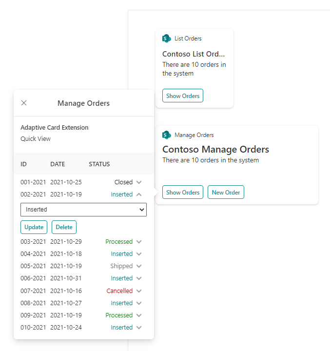

# Contoso Orders - Demo

## Summary

This is a sample solution that illustrates how to consume a multi-tenant API within a set of Microsoft Viva Connections Adaptive Card Extensions (ACEs) developed with SharePoint Framework (SPFx).
The goal of this sample is to share with partners and ISVs how simple it is to create a modern solution for Microsoft Viva Connections using SharePoint Framework.

## Applies to

- [SharePoint Framework](https://aka.ms/spfx)
- [Microsoft Viva Connections](https://www.microsoft.com/en-us/microsoft-viva/connections)
- [Microsoft 365 tenant](https://docs.microsoft.com/en-us/sharepoint/dev/spfx/set-up-your-developer-tenant)

> Get your own free development tenant by subscribing to [Microsoft 365 developer program](http://aka.ms/o365devprogram)

## Documentation
You can find additional technical details about the solution reading the following documents:
- [Contoso Orders - Demo - Introduction](./docs/Introduction.md)
- [Minimal Path to Awesome](./docs/MinimalPathToAwesome.md)
- [ACEs Implementation Details](./docs/ACEs-Implementation-Details.md)
- [APIs Implementation Details](./docs/APIs-Implementation-Details.md)

## Prerequisites

The SPFx solution relies on a set of APIs built with .NET Core. The source code of the APIs is available [here](./src/Contoso.Orders.FunctionApp) in this repository.

The SPFx solution is available [here](./src/Contoso.Orders.SPFx) in this repository.

You can also find provisioning scripts in [this folder](./src/Scripts) of this repository.

## Solution

Solution|Author(s)
--------|---------
Contoso.Orders.SPFx | Paolo Pialorsi - [PiaSys.com](https://www.piasys.com/) - [@PaoloPia](https://twitter.com/PaoloPia)

## Version history

Version|Date|Comments
-------|----|--------
1.0|October 31, 2021|Initial release

## Disclaimer

**THIS CODE IS PROVIDED *AS IS* WITHOUT WARRANTY OF ANY KIND, EITHER EXPRESS OR IMPLIED, INCLUDING ANY IMPLIED WARRANTIES OF FITNESS FOR A PARTICULAR PURPOSE, MERCHANTABILITY, OR NON-INFRINGEMENT.**

---

## Minimal Path to Awesome
Follow [this link](./docs/MinimalPathToAwesome.md) learn how to deploy this sample solution.

## Features

The ACEs included in this project allow you to:
- browse a list of demo orders, via the ListOrders ACE
- browse and manage (add, update, delete) a list of demo orders, via the ManageOrders ACE

## References

- [Getting started with SharePoint Framework](https://docs.microsoft.com/en-us/sharepoint/dev/spfx/set-up-your-developer-tenant)
- [Building for Microsoft teams](https://docs.microsoft.com/en-us/sharepoint/dev/spfx/build-for-teams-overview)
- [Use Microsoft Graph in your solution](https://docs.microsoft.com/en-us/sharepoint/dev/spfx/web-parts/get-started/using-microsoft-graph-apis)
- [Publish SharePoint Framework applications to the Marketplace](https://docs.microsoft.com/en-us/sharepoint/dev/spfx/publish-to-marketplace-overview)
- [Microsoft 365 Patterns and Practices](https://aka.ms/m365pnp) - Guidance, tooling, samples and open-source controls for your Microsoft 365 development