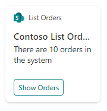
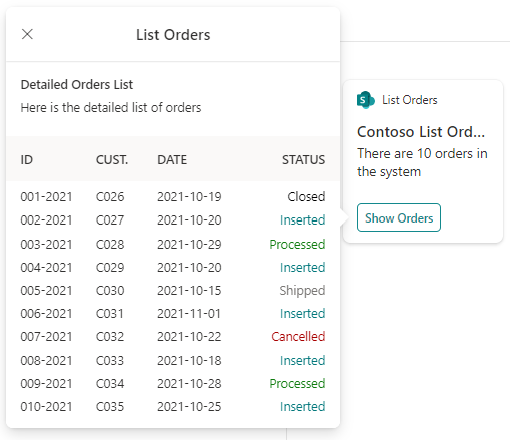
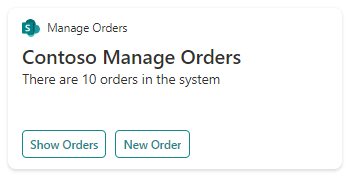
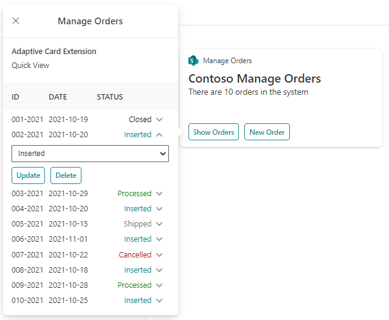
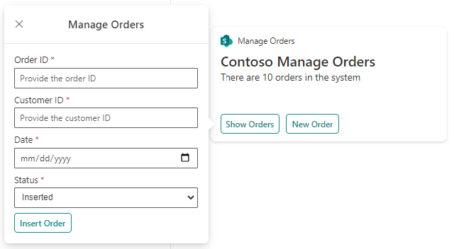

# <a name="Intro">Contoso Orders - Demo - Introduction</a>

The Contoso Orders is a sample solution that illustrates how to consume a multi-tenant API within a set of Microsoft Viva Connections Adaptive Card Extensions (ACEs) developed with SharePoint Framework (SPFx). The goal of this sample is to share with partners and ISVs how simple it is to create a modern solution for Microsoft Viva Connections using SharePoint Framework.

The orders under the cover of the solution are randomly generated and associated with the current user's profile. As such, you should not rely on the actual content of the orders, but you should simply take inspiration from the solution.

## <a name="ACEs">Main functionalities of the ACEs</a>
The solution showcases two Adaptive Card Extensions (ACEs) for Microsoft Viva Connections:
- List Orders: browse a list of demo orders, via the ListOrders ACE
- Manage Orders: browse and manage (add, update, delete) a list of demo orders, via the ManageOrders ACE

Let's have a sneak peak of both of them.

### <a name="ListOrders">List Orders</a>
This ACE provides a basic CardView that allows to see the number of orders in a demo list of orders.

Clicking on the "Show Orders" button you can activate a QuickView that will show the whole list of orders.

The ACE allows to consume data in read-only mode, and as such you can't edit any of the order items.

### <a name="ManageOrders">Manage Orders</a>
This ACE provides a basic CardView that allows to see the number of orders in a demo list of orders, like with the List Orders ACE.

However, clicking on the "Show Orders" button, you can activate a QuickView through which you can see the whole list of orders and you can edit the status of any of the orders in the list.

As you can see, clicking on the arrow down, just beside of an order, you can edit the order status via a dropdown list and you can click on the "Updated" button to save the updated status. You can also click on the "Delete" button to delete the currently selected order.

If you click on the "New Order" button, you can activate a QuickView through which you can add a new order to the system.

In the QuickView you have to provide the Order ID, the Customer ID, the Order Date, and the Order Status. Then you can click on the "Insert Order" button to save the new order. A succesful order creation will be confirmed with a small QuickView with a confirmation message.

If you want to dig into the development of the ACEs, you can read the [following document](ACEs-Implementation-Details.md).

## <a name="BackEnd">About the back-end APIs</a>
Under the cover of the solution there is a set of REST APIs - implemented as an Azure Function App - that are configured to work in a multi-tenant environment. It is importante to notice that the APIs are secured with Azure Active Directory (AAD) and when the ACEs access the API endpoint they provide an OAuth 2.0 Access Token with specific permission scopes.
In fact, the APIs are registered in AAD and provide a couple of permission scopes:
- Orders.Read: allows reading the whole list of orders and retrieving a specific order by ID.
- Orders.FullControl: allows what is granted via the Orders.Read permission scope, plus grants the capability to add, update, or delete a specific order by ID.

The operations offered by the Function App are:
- GetOrders: returns the list of orders, requires at least the Orders.Read permission scope.
- GetOrder: returns a specific order by ID, requires at least the Orders.Read permission scope.
- AddOrder: adds a new order to the system, requires at least the Orders.FullControl permission scope.
- UpdateOrder: updated an already existing order in the system, requires at least the Orders.FullControl permission scope.
- DeleteOrder: deletes an already existing order from the system, requires at least the Orders.FullControl permission scope.
- GrantPermissions: handles the redirect flow while consenting permissions for the app in a target tenant, does not require any specific permission.

From a learning point of view, this is a really useful example to understand how to secure APIs with AAD and how to validate permissions scopes in the APIs internal logic.

If you want to dig into the development of the back-end API, you can read the [following document](APIs-Implementation-Details.md).
