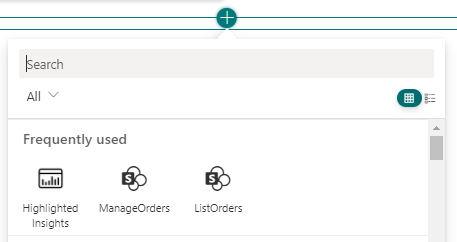

## <a name="PathToAwesome">Minimal Path to Awesome</a>

- Clone this repository
- Ensure that you are at the solution folder
- Open a PowerShell terminal and move into the [Scripts](../src/Scripts) folder
- Execute the following PowerShell script:
  - [Register-PnPContosoOrders.ps1](../src/Scripts/Register-PnPContosoOrders.ps1) with the following syntax

```PowerShell
.\Register-PnPContosoOrders.ps1 -TenantName [name-of-target-tenant]
```

Replace [name-of-target-tenant] with the name of the target tenant. For example, if your tenant name is contoso.onmicrosoft.com, you should provide just the value 'contoso'.

If you like to use a web browser interactive login, for example to rely on MFA, you can use the following syntax:


```PowerShell
.\Register-PnPContosoOrders.ps1 -TenantName [name-of-target-tenant] -LaunchBrowser
```

If you want to provide a pre-defined set of credentials, you can provide a *PSCredential* object with the following syntax:

```PowerShell
.\Register-PnPContosoOrders.ps1 -TenantName [name-of-target-tenant] -Credentials $credentials
```

Where the *$credentials* argument represents a valid *PSCredential* instance.

Regardless how you will start the PowerShell command, follow the instructions on screen and:
- consent the Azure AD application in your browser
- grant the API permissions for the app in the API Access page of SharePoint Online for the API with name "PnP.Contoso.Orders" and for permission scope "Orders.FullControl"

Once you have done that, open the browser and access your target tenant. Browse to the Microsoft Viva Connections dashboard or to the SPFx workbench, edit the page, and add any of the following ACEs:
- ListOrders
- ManageOrders



Configure the ACEs, via the property pane panel on the right side of the screen, in order to use for "OrderService Base Url" the followin value:

https://pnp-contoso-orders.azurewebsites.net/

> For the sake of simplicity, you don't necessarily need to setup the back-end REST API on your own environment. You simply need to rely on a Microsoft-hosted API, which is available at the following URL: https://pnp-contoso-orders.azurewebsites.net/.