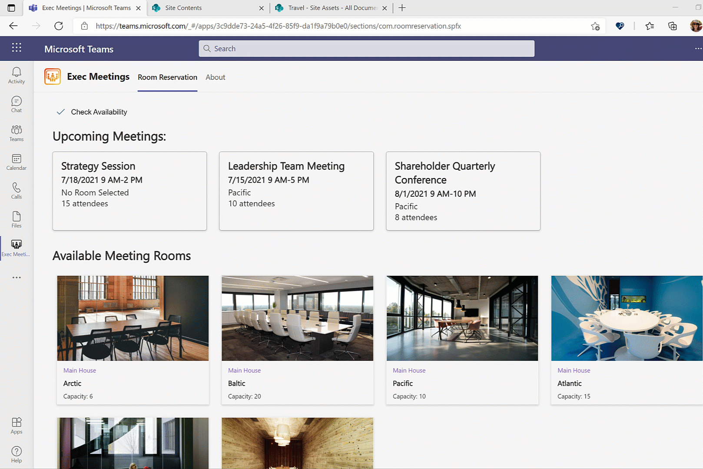
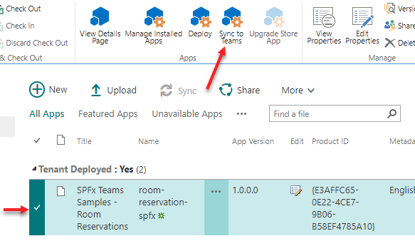

# Executive Room Reservation Reference Microsoft Teams Personal App

## Summary

> To see a video overview of this solution check out this resource on YouTube: https://youtu.be/5GJHlMCQMBo

The Executive Room Reservation application is an executive scheduling application that allows users to see upcoming meetings, select and book a room based on availability dates and the number of participants. Users can see a photo of the room where the meeting is booked, get an address to the building to put in the meeting invite, and get directions to the building. It provides a seamless way for executive assistants to schedule meeting rooms for executive meetings. The application demonstrates the ability to create a visually engaging Microsoft Teams based solution.

This application uses demo data for the personal app that is stored in a JSON file in the root site collection `Site Assets` library in a folder called `RoomReservation`. It can extended to integrate with the room scheduling software or APIs that are used by your organization.

### Viva Dashboard Adaptive Card Extension (ACE)

This solution also contains a Viva Desktop Adaptive Card Extension. At this time the Dashboard page layout is not generally available so unless you were part of the private preview program you will not be able to add the extension to a page in SharePoint however, if you have access to SPFx 1.13 you can download the source code and serve the solution into the workbench to view the ACE.

## Used SharePoint Framework Version

## Applies to

- [SharePoint Framework](https://aka.ms/spfx)
- [Microsoft 365 tenant](https://docs.microsoft.com/en-us/sharepoint/dev/spfx/set-up-your-developer-tenant)

> Get your own free development tenant by subscribing to [Microsoft 365 developer program](http://aka.ms/o365devprogram)

## Solution

Solution|Author(s)
--------|---------
room-reservation-spfx | Sympraxis Consulting (@SympraxisC)

## Version history

Version|Date|Comments
-------|----|--------
1.0|September 8, 2021|Initial release

## Disclaimer

**THIS CODE IS PROVIDED *AS IS* WITHOUT WARRANTY OF ANY KIND, EITHER EXPRESS OR IMPLIED, INCLUDING ANY IMPLIED WARRANTIES OF FITNESS FOR A PARTICULAR PURPOSE, MERCHANTABILITY, OR NON-INFRINGEMENT.**

---

## Minimal Path to Awesome

### Deploy Default Build

A default solution (sppkg) file for this sample exists in the [deployment](./deployment) folder. This sppkg will need to be deployed in the tenants site collection app catalog with the `Make this solution available to all sites in the organization` option selected. By doing so the solution will be available in every site collection in the tenant, however since the solution has not been enabled for SharePoint deployment it will not be seen anywhere in the UX. Instead, the Teams manifest that is included in the package will be deployed which creates a Personal App that can then be pinned to the left rail in Teams and, if desired, audience targeted to specific user groups using the [Manage app setup policies in Microsoft Teams](https://docs.microsoft.com/en-us/MicrosoftTeams/teams-app-setup-policies). Further, the App is then also available to be added to individual Teams to provide a Team level experience.

Steps for deployment:

1. Download the SPPKG file, navigate to the [room-reservation-spfx.sppkg](./deployment/room-reservation-spfx.sppkg) file in the [deployment](./deployment) folder of this repository. Select `Download` to save the file to your computer.
1. Upload the sppkg file into the tenant's app catalog by selecting upload, finding the file, and then selecting `OK`.

    

1. A dialog will be displayed asking if you trust the solution. **Make sure you check the `Make this solution available to all sites in the organization`** check box and then select `Deploy`.

    

1. Once the solution has been added to the app catalog be sure to check in the file.

1. After the solution has deployed you will need to sync the solution into your Teams app store. To do so, select the `SPFx Teams Samples - Room Reservations` solution in the app catalog and then under the files tab in the ribbon the `Sync to Teams` option will be enabled, select it.

    

1. Assuming you received no errors while the solution during the Teams sync, and you've approved the API permissions, you should now be able to add it into your Teams App Bar as a personal tab. You may want to consider adding the app as a custom pinned site based on the Teams setup policies, you can learn more about doing so by visiting [Manage app setup policies in Microsoft Teams](https://docs.microsoft.com/en-us/MicrosoftTeams/teams-app-setup-policies). Further, for more information on changing the permissions on who has access to the app, you can read more [View app permissions and grant admin consent in the Microsoft Teams admin center](https://docs.microsoft.com/en-us/microsoftteams/app-permissions-admin-center).

## References

- [Extend Microsoft Viva Connections Learn Path](https://aka.ms/m365/dev/learn/connections)
- [Getting started with SharePoint Framework](https://docs.microsoft.com/en-us/sharepoint/dev/spfx/set-up-your-developer-tenant)
- [Building for Microsoft teams](https://docs.microsoft.com/en-us/sharepoint/dev/spfx/build-for-teams-overview)
- [Use Microsoft Graph in your solution](https://docs.microsoft.com/en-us/sharepoint/dev/spfx/web-parts/get-started/using-microsoft-graph-apis)
- [Publish SharePoint Framework applications to the Marketplace](https://docs.microsoft.com/en-us/sharepoint/dev/spfx/publish-to-marketplace-overview)
- [Microsoft 365 Patterns and Practices](https://aka.ms/m365pnp) - Guidance, tooling, samples and open-source controls for your Microsoft 365 development

