# Wellbeing days requests and reminder - Adaptive Cards Extensions and Teams personal app

## Summary

The video below shows the wellbeing days requests and reminder solution in action.

https://user-images.githubusercontent.com/9694225/152380807-8db8cf55-e58b-4ec4-a42d-7205509372c3.mp4

This sample allows booking and managing well being days for users.
By using the wellbeing reminder Adaptive Card Extension (ACE), a user (requestor) can submit a request for a well being day. 
Another user (manager) can then action this request using the combination of the wellbeing requests Adaptive Card Extension and the well being requests Teams personal app.

While actioning a request, the app shows the calendar of a group to the manager, so that the manager can take a decision based on the events occuring on or around the submiited wellbeing day of the request. 
The data for the sample is driven from SharePoint lists and a calendar associated with a team (underlying group).

### Wellbeing reminder Adaptive Card Extension 

With the help of this ACE a user can view the number of remaining well being days and schedule a well being day.

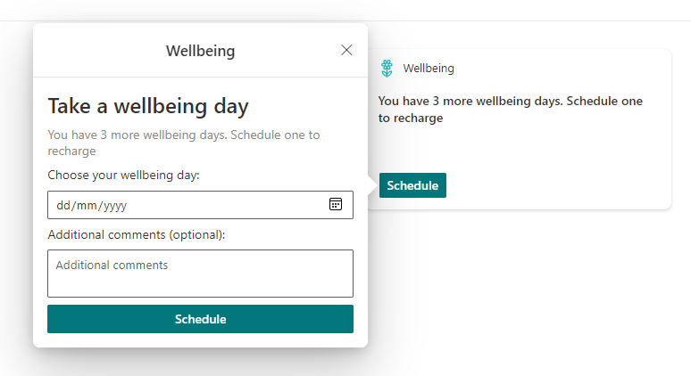

### Wellbeing requests Adaptive Card Extension

With the help of this ACE a user (manager) can view the number of pending well being requests and select a request to action.

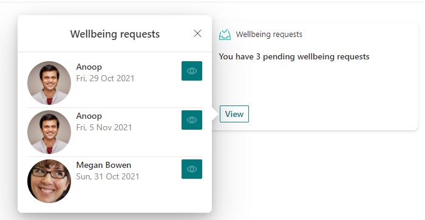

### Wellbeing requests teams personal app

With the help of the teams personal app a user (manager) can action one or more requests.

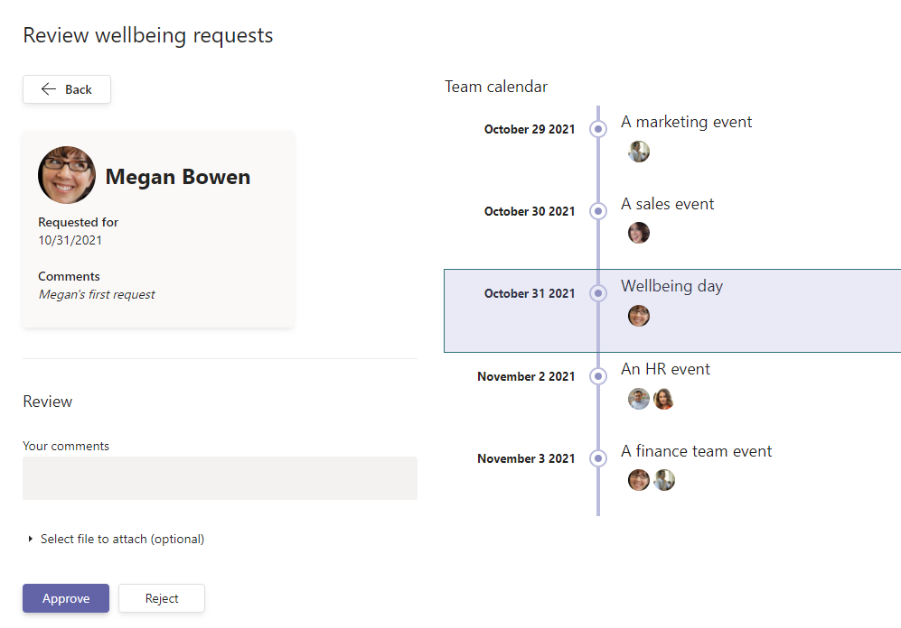

## Used SharePoint Framework Version

## Applies to

- [SharePoint Framework](https://aka.ms/spfx)
- [Microsoft 365 tenant](https://docs.microsoft.com/en-us/sharepoint/dev/spfx/set-up-your-developer-tenant)

> Get your own free development tenant by subscribing to [Microsoft 365 developer program](http://aka.ms/o365devprogram)

## Solution

Solution|Author(s)
--------|---------
m365-spfx-wellbeing | [Waldek Mastykarz](https://github.com/waldekmastykarz) , [Anoop Tatti](https://github.com/anoopt) ([https://linktr.ee/anoopt](https://linktr.ee/anoopt))

## Version history

Version|Date|Comments
-------|----|--------
1.0|February 3, 2022|Initial release

## Disclaimer

**THIS CODE IS PROVIDED *AS IS* WITHOUT WARRANTY OF ANY KIND, EITHER EXPRESS OR IMPLIED, INCLUDING ANY IMPLIED WARRANTIES OF FITNESS FOR A PARTICULAR PURPOSE, MERCHANTABILITY, OR NON-INFRINGEMENT.**

---

## Minimal Path to Awesome

### Initial Setup

The sample works as per the image shown below.

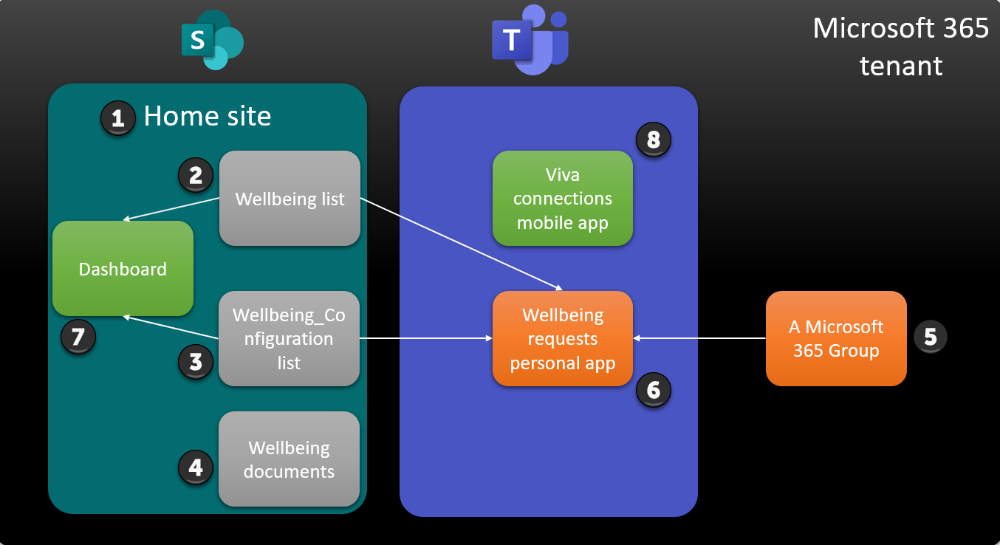

The elements needed are:
1. The home site of the tenant. If not already set then please follow the instructions mentioned in [this Microsoft](https://docs.microsoft.com/en-us/sharepoint/home-site) article.
2. A list in the home site to hold the well being requests. A PowerShell script will be used to create this.
3. A list to hold some configuration entries needed for the sample. A PowerShell script will be used to create this.
4. A document library that contains documents used as attachements while actioning well being requests.
5. An existing Microsoft 365 group. This can be any Microsoft 365 group in the tenant. The calendar of this group will be used so that the manager can take a decision based on the events occuring on or around the submitted wellbeing day of the request.
6. The well being requests Teams personal app that will be used by a manager to action one or more requests.
7. The dashboard on the home site which will have the well being ACEs.
8. The viva connections app on Teams mobile which will have a dashboard to show the ACEs.

### Creating the elements
A [PowerShell script](./setup/CreateLists.ps1) supplied with this sample creates the well being list and the configuration list.
The script uses [PnP.PowerShell](https://docs.microsoft.com/en-us/powershell/sharepoint/sharepoint-pnp/sharepoint-pnp-cmdlets) cmdlets to do so.
Before running the script please make sure the following are in place:
- The URL of the home site
- The email address of the Microft 365 group
- The title of the document library in the home site which will hold the documents related to well being requests

After running the script, make sure that the home site has
- A list named **Wellbeing**
- A list named **Wellbeing_Configuration**
  - 3 items are present in this list

### Deploy Default Build

A default solution (sppkg) file for this sample exists in the [deployment](./deployment) folder. This sppkg will need to be deployed in the tenants site collection app catalog with the `Make this solution available to all sites in the organization` option selected. By doing so the solution will be available in every site collection in the tenant, however since the solution has not been enabled for SharePoint deployment it will not be seen anywhere in the UX. Instead, the Teams manifest that is included in the package will be deployed which creates a Personal App that can then be pinned to the left rail in Teams and, if desired, audience targeted to specific user groups using the [Manage app setup policies in Microsoft Teams](https://docs.microsoft.com/en-us/MicrosoftTeams/teams-app-setup-policies). Further, the App is then also available to be added to individual Teams to provide a Team level experience.

Steps for deployment:

1. Download the .sppkg file, navigate to the [m365-spfx-wellbeing.sppkg](./deployment/m365-spfx-wellbeing.sppkg) file in the [deployment](./deployment) folder of this repository. Select `Download` to save the file to your computer.

2. Upload the sppkg file into the tenant's app catalog by selecting upload, finding the file, and then selecting `OK`.

    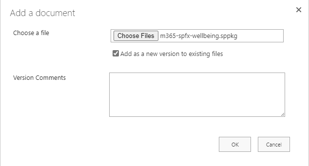

3. A dialog will be displayed asking if you trust the solution. **Make sure you check the `Make this solution available to all sites in the organization`** check box and then select `Deploy`.

    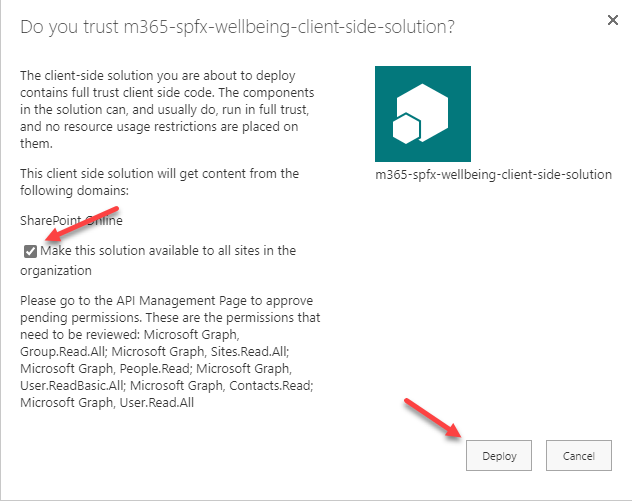

4. Once the solution has been added to the app catalog be sure to check in the file.

5. After the solution has deployed you will need to sync the solution into your Teams app store. To do so, select the `m365-spfx-wellbeing-client-side-solution` solution in the app catalog and then under the files tab in the ribbon the `Sync to Teams` option will be enabled, select it.

    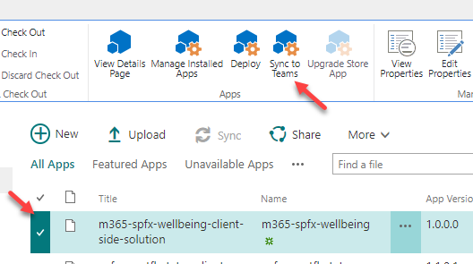

6. Assuming you received no errors while the solution during the Teams sync, and you've approved the API permissions, you should now be able to add it into your Teams App Bar as a personal tab. You may want to consider adding the app as a custom pinned site based on the Teams setup policies, you can learn more about doing so by visiting [Manage app setup policies in Microsoft Teams](https://docs.microsoft.com/en-us/MicrosoftTeams/teams-app-setup-policies). Further, for more information on changing the permissions on who has access to the app, you can read more [View app permissions and grant admin consent in the Microsoft Teams admin center](https://docs.microsoft.com/en-us/microsoftteams/app-permissions-admin-center).

### Post deployment setup

#### Get the ID of the Teams personal app

To get the ID of the wellbeing Teams personal app using PnP PowerShell run the following PnP PowerShell cmdlet
  `Get-PnPTeamsApp -Identity "Wellbeing request review"`

To get the ID of the wellbeing Teams personal app using Microsoft 365 CLI run the following Microsoft 365 CLI cmdlet
  `m365 teams app list --query "[?displayName == 'Wellbeing request review']"`

Copy the value of Id (or id) as it will be needed for the ACE.

#### Add the ACEs to the dashboard

1. Navigate to the dashboard page of your SharePoint home site 
    
    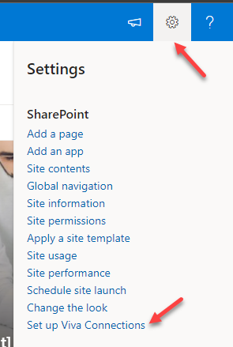

2. Edit the page and add the `Wellbeing reminder` ACE
    
    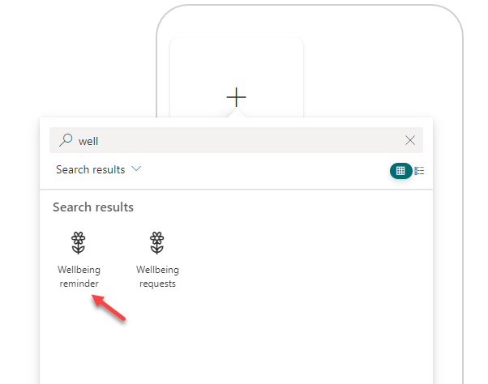

3. Add the `Wellbeing requests` ACE
    
    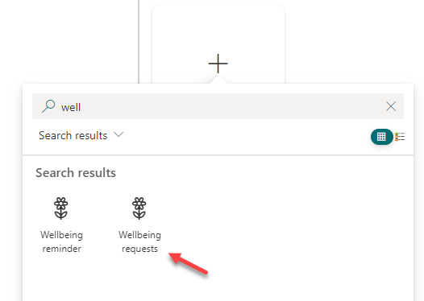

4. Configure the `Wellbeing requests` ACE by 
    a. Adding the ID of the Teams personal app copied earlier in the `Wellbeing Teams App Id` property
    b. Adding users (managers) in the `Audience to target` property

    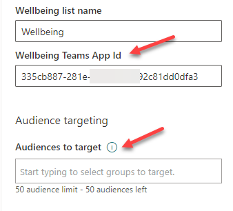

## References

- [Extend Microsoft Viva Connections Learn Path](https://aka.ms/m365/dev/learn/connections)
- [Getting started with SharePoint Framework](https://docs.microsoft.com/en-us/sharepoint/dev/spfx/set-up-your-developer-tenant)
- [Building for Microsoft teams](https://docs.microsoft.com/en-us/sharepoint/dev/spfx/build-for-teams-overview)
- [Use Microsoft Graph in your solution](https://docs.microsoft.com/en-us/sharepoint/dev/spfx/web-parts/get-started/using-microsoft-graph-apis)
- [Publish SharePoint Framework applications to the Marketplace](https://docs.microsoft.com/en-us/sharepoint/dev/spfx/publish-to-marketplace-overview)
- [Microsoft 365 Patterns and Practices](https://aka.ms/m365pnp) - Guidance, tooling, samples and open-source controls for your Microsoft 365 development
