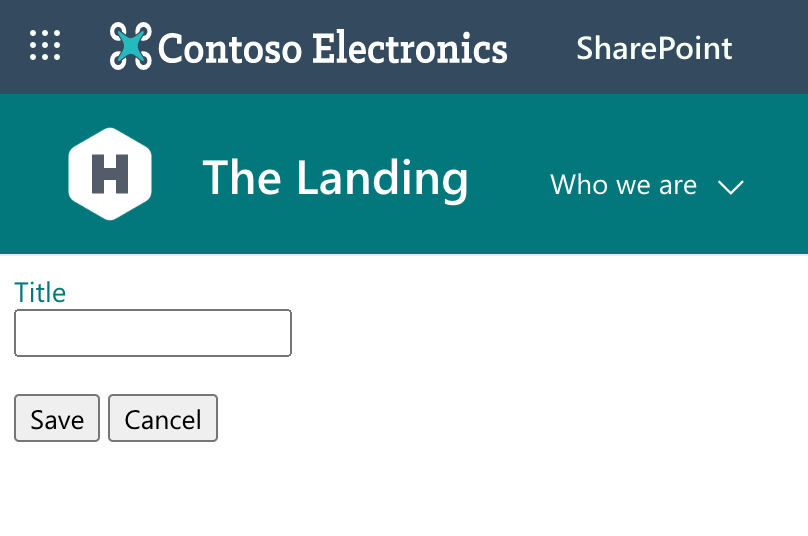
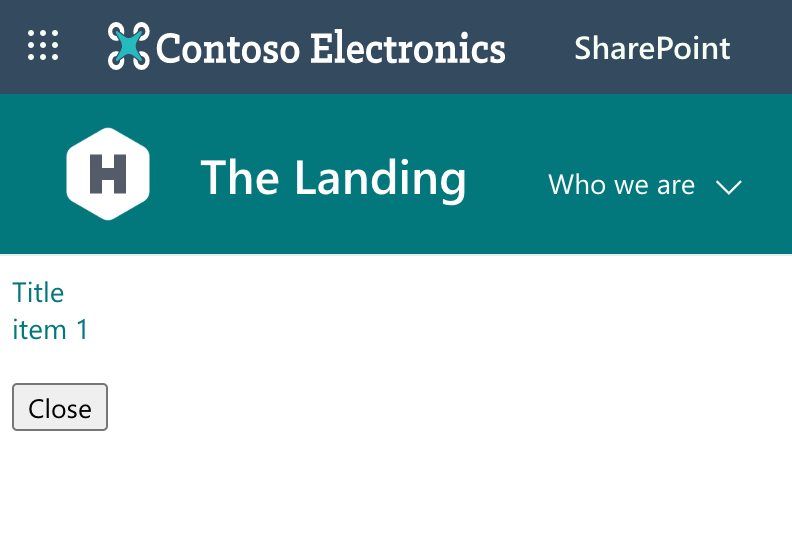

# spfx-formcustomizer-basics

## Summary

This sample illustrates how to build a basic list form customizer using SharePoint Framework and handle view, new and edit modes without using any JavaScript frameworks.

New form:

Edit form:

View form:

## Used SharePoint Framework Version

## Applies to

- [SharePoint Framework](https://aka.ms/spfx)
- [Microsoft 365 tenant](https://docs.microsoft.com/sharepoint/dev/spfx/set-up-your-developer-tenant)

> Get your own free development tenant by subscribing to [Microsoft 365 developer program](https://aka.ms/o365devprogram)

## Prerequisites

- Node@14.17.x
- yo@4
- gulp@4

## Solution

| Solution    | Author(s)                                               |
| ----------- | ------------------------------------------------------- |
| spfx-formcustomizer-basics | Waldek Mastykarz (Microsoft, @waldekm) |

## Version history

| Version | Date             | Comments        |
| ------- | ---------------- | --------------- |
| 1.0     | June 3, 2022 | Initial release |

## Disclaimer

**THIS CODE IS PROVIDED _AS IS_ WITHOUT WARRANTY OF ANY KIND, EITHER EXPRESS OR IMPLIED, INCLUDING ANY IMPLIED WARRANTIES OF FITNESS FOR A PARTICULAR PURPOSE, MERCHANTABILITY, OR NON-INFRINGEMENT.**

---

## Minimal Path to Awesome

- Clone this repository
- Ensure that you are at the solution folder
- in the `config/serve.json` file adjust the URL of your SharePoint site and the name of your list
- in the command-line run:
  - **npm install**
  - **gulp serve**

## Features

This sample illustrates how to build a basic list form customizer using SharePoint Framework and handle view, new and edit modes without using any JavaScript frameworks.

This solution illustrates the following concepts:

- handling different list form modes
- loading the current list item using SharePoint REST APIs
- updating a list item using SharePoint REST APIs, ensuring data integrity
- creating a new list item using SharePoint REST APIs
- saving changes to list item in a custom form
- handling errors

## References

- [Getting started with SharePoint Framework](https://docs.microsoft.com/sharepoint/dev/spfx/set-up-your-developer-tenant)
- [Building for Microsoft teams](https://docs.microsoft.com/sharepoint/dev/spfx/build-for-teams-overview)
- [Use Microsoft Graph in your solution](https://docs.microsoft.com/sharepoint/dev/spfx/web-parts/get-started/using-microsoft-graph-apis)
- [Publish SharePoint Framework applications to the Marketplace](https://docs.microsoft.com/sharepoint/dev/spfx/publish-to-marketplace-overview)
- [Microsoft 365 Patterns and Practices](https://aka.ms/m365pnp) - Guidance, tooling, samples and open-source controls for your Microsoft 365 development
