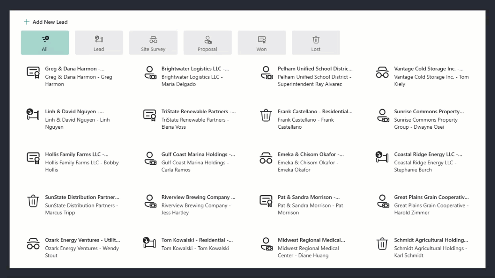

# Sales Lead System Sample

## Summary

A SharePoint Framework (SPFx) solution that demonstrates how to build a full CRUD business application on SharePoint. It manages solar energy sales leads through their lifecycle — from initial lead through site survey and proposal to won or lost — using a custom SharePoint list, a React web part, and a Form Customizer extension that replaces the default SharePoint list forms.

On first load the solution automatically creates the **Sales Leads** list, attaches a custom content type with the Form Customizer wired to New/Edit/Display forms, and seeds the list with sample data so there is something to explore immediately.

### Screenshots



## Architecture Overview

The solution packages two SPFx components that share a single service and set of React components:

- **Web Part** (`sales-lead-web-part`) — Renders inside a SharePoint modern page. Shows a filterable list of leads and a detail/edit form inline.
- **Form Customizer** (`sales-lead-form-form-customizer`) — Replaces the default SharePoint list New/Edit/Display forms with the same `LeadForm` React component used by the web part. This solution utilizes the new `isPanelExperienceEnabled` that will allow the form to appear in the list or libraries view/edit dialog instead of loading a new page.

**Shared service singleton** (`src/common/services/slService.ts`):  
`SalesLeadService` is instantiated once at module load (`export const sl`) and initialized by the web part or form customizer via `sl.Init()`. It owns all SharePoint data access (PnP JS v4), an in-memory lead cache, and locale-aware date/currency formatters.

**Component hierarchy:**

```
SalesLeadWebPart
  └─ SalesLead            (list/form container — switches between two modes)
       ├─ LeadsList
       │    └─ LinkItem   (one card per lead)
       └─ LeadForm
            ├─ NavSelector → NavItem   (status / installation type / financing toggles)
            └─ UserLookup → UserPill   (typeahead people picker)
```

## Used SharePoint Framework Version


## Applies to

- [SharePoint Framework](https://aka.ms/spfx)
- [Microsoft 365 tenant](https://docs.microsoft.com/sharepoint/dev/spfx/set-up-your-developer-tenant)

> Get your own free development tenant by subscribing to [Microsoft 365 developer program](http://aka.ms/o365devprogram)

## Prerequisites

- A Microsoft 365 tenant with a SharePoint site collection where you have **Site Owner** or **Site Collection Administrator** permissions. These are required on first run when the solution creates the list and sets up the content type.
- The **Sales Lead** site content type (`0x01009F7EEC938CE60548A94915C28DF5CAC4`) and its associated site columns (`SLStatus`, `SLClient`, `SLMarket`, etc.) will be provisioned during install into the site collection's content type gallery.
- Node.js **22.x** (see the `engines` field in `package.json`).

## Solution

| Solution | Author(s) |
| -------- | --------- |
| sales-lead-system | Sympraxis Consulting |

## Version history

| Version | Date             | Comments        |
| ------- | ---------------- | --------------- |
| 1.0     | July 1, 2026 | Initial release |

## Disclaimer

**THIS CODE IS PROVIDED _AS IS_ WITHOUT WARRANTY OF ANY KIND, EITHER EXPRESS OR IMPLIED, INCLUDING ANY IMPLIED WARRANTIES OF FITNESS FOR A PARTICULAR PURPOSE, MERCHANTABILITY, OR NON-INFRINGEMENT.**

---

## Minimal Path to Awesome

- Clone this repository
- Ensure you are in the solution folder
- In the command-line run:
  - `npm install -g @rushstack/heft`
  - `npm install`
  - `heft start`
- Navigate to a SharePoint modern page in a browser, add the **Sales Lead System** web part, and trust the local certificate if prompted. On first load the solution creates the list, configures the content type, and seeds the list with sample data automatically.

Other build commands:

```shell
heft test --clean                                                          # run tests
heft test --clean --production && heft package-solution --production       # create .sppkg for deployment
```

Full command reference: `heft --help`

## Features

This sample illustrates how to build a complete CRUD SharePoint application with an SPFx web part and Form Customizer sharing business logic through a service singleton.

- **Filterable lead list** — Browse leads filtered by pipeline status (Lead, Site Survey, Proposal, Won, Lost) using a custom toggle-button nav selector.
- **Detail and edit form** — View all lead details read-only; click Edit to switch to an inline editable form with field validation and dirty-state tracking.
- **New lead creation** — Add leads from the web part command bar.
- **People picker** — Assign leads to a sales rep using typeahead search backed by the SharePoint Search People result source.
- **Custom list forms** — The Form Customizer replaces the default SharePoint New/Edit/Display forms with the same `LeadForm` component used in the web part.
- **Automatic first-run setup** — On first load the solution creates the SharePoint list, attaches the custom content type, wires up the Form Customizer, and seeds the list with 50 sample leads.

## Key Patterns Demonstrated

- **SPFx ServiceScope** — `SalesLeadService` consumes `PageContext` via `serviceScope.whenFinished()`, the correct pattern for accessing SPFx services that are not available at construction time.
- **PnP JS v4 (`@pnp/sp`)** — OData queries with `select`/`expand` for lookup fields, `batched()` for bulk inserts, `ensureUser()` for resolving people-picker identities to numeric SharePoint User IDs.
- **hTWOo-React (`@n8d/htwoo-react`)** — Microsoft Fluent design system components without a dependency on `@fluentui/react`.
- **Form Customizer** — How to replace SharePoint's built-in list forms with a custom React component, and how to wire the component ID to a content type so it applies automatically to all New/Edit/Display forms.
- **Initialization polling** — Pattern for SPFx web parts that depend on async service initialization: poll `sl.ready` with `setInterval` and re-render once the service signals it is ready.
- **PnP Search People** — Using `SearchQueryBuilder` with the SharePoint People Search result source to implement a typeahead user lookup.

## References

- [Getting started with SharePoint Framework](https://docs.microsoft.com/sharepoint/dev/spfx/set-up-your-developer-tenant)
- [Building for Microsoft Teams](https://docs.microsoft.com/sharepoint/dev/spfx/build-for-teams-overview)
- [Form Customizer extension](https://docs.microsoft.com/sharepoint/dev/spfx/extensions/get-started/building-form-customizer)
- [PnP JS v4 documentation](https://pnp.github.io/pnpjs/)
- [hTWOo-React documentation](https://lab.n8d.studio/htwoo/)
- [Microsoft 365 Patterns and Practices](https://aka.ms/m365pnp) - Guidance, tooling, samples and open-source controls for your Microsoft 365 development
- [Heft Documentation](https://heft.rushstack.io/)
